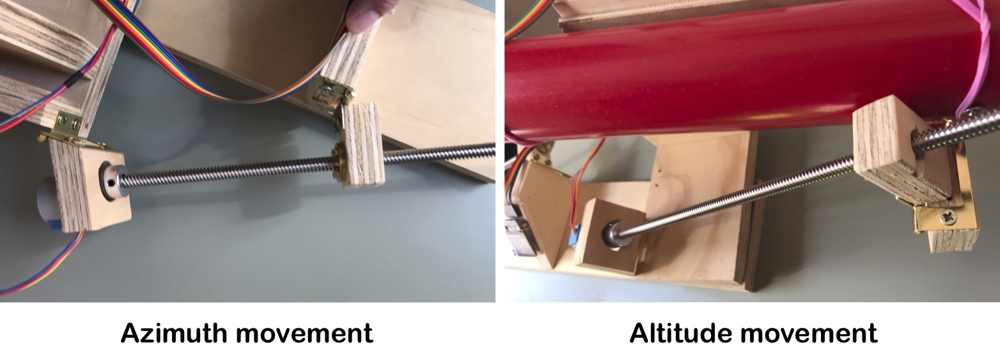
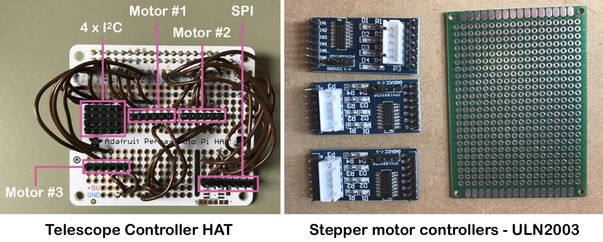

# Lockdown Telescope

Also stuck at home during this lockdown? Let's build a telescope! 

_More to be added!_


## Components
* **A telescope!** I got a second-hand Tasco 57T from the [Oxfam charity shop](https://www.oxfam.org.uk/) in Stratford-Upon-Avon (£15) 

* **A [Raspberry Pi 4](https://shop.pimoroni.com/products/raspberry-pi-4?variant=29157087412307)** - this'll be the brains of the operation. I choose the 4 since it can operate in the [On-The-Go (OTG) mode](https://en.wikipedia.org/wiki/USB_On-The-Go) over USB-C, which means I can plug my computer straight into it instead of connecting via WiFi should I decide to use the telescope away from my back yard once the lockdown ends. The Raspberry Pi Zero does this also, but I figured I could do with more processing power. Regardless, new things are fun. (Pimoroni - £33.90)

* **A camera.** [The Raspberry Pi Camera](https://shop.pimoroni.com/products/raspberry-pi-camera-module-v2-1-with-mount?variant=19833929735) (Pimoroni - £24)

* **Three stepper motors and controller boards.** These will control altitude, azimuth and focus motion on the telescope. I got 28BYJ-48 motor with the ULN2003 motor driver board on eBay for the total price of £8.38! 

* **Two lead screws with fittings.** These will translate the rotating motor motion to a linear motion that will move the telescope up/down (altitude) and left/right (azimuth). Since these form part of lots of 3D printers, they're everywhere and quite affordable. I got two 300 mm screws that came with both the nuts and the motor couplers (eBay  - £16.70)

* **An inertial measurement unit (IMU).** This will give the direction that the telescope is pointing in. I use the [ICM20948](https://shop.pimoroni.com/products/icm20948) from Pimoroni's Breakout Garden suite of controllers that has a magnetometer (for the azimuth pointing), a gyroscope and accelerometer (for the altitude posting) (Pimoroni - £13.80)

* **A screen** for a fancy interface and exposure previews. Pimoroni makes this [really cute 240x240 display (ST7789)](https://shop.pimoroni.com/products/1-3-spi-colour-lcd-240x240-breakout) as part of their Breakout Garden. (Pimoroni - £15)

* **Two lazy susans** with bearings for a smooth rotation. (eBay - £5.18)

* **A coupler** that can connect the stepper motor and the focus shaft (eBay - 3.49)


* **A prototyping board** to organise the various connections. The [Adafruit Perma-Proto HAT](https://shop.pimoroni.com/products/adafruit-perma-proto-hat-for-pi-mini-kit?variant=1038451613) is excellent for this (Pimoroni - £4.80)

* **Bits of wood** for the telescope mount. I have quite a bit of 18 mm plywood left over from when I built my kitchen, so will consider it free of charge. 🌳

* **A bluetooth game pad.** I want something that'll manually move and focus the telescope and navigate the menu of the screen, so what better option than a games controller! 
I already got the [8BitDo SN30 Bluetooth Gamepad](https://shop.pimoroni.com/products/8bitdo-sn30-bluetooth-gamepad?variant=30713757597779) to use with my RetroPi setup. 

## Building the telescope mount

Using my trusted circular saw, some plywood, and the two lazy susans I did cobble together  a rudimentary telescope mount. Since I had no solid plan when I started sawing, I had to swap quite a few pieces out until it made sense. I was trying to make sure that the telescope had a range in altitude and azimuth that covered the view in my back-yard (180 degrees of azimuth and horizon to zenith in altitude). Using lead-screws as a telescope driver limits the use of the telescope to a portion of the sky. 


## The camera 

In order to use the Raspberry Pi Camera (v. 2.1) in a telescope, the attached lens has to be removed. The lens can be screwed out, but I found it terribly difficult to get any traction on it, so made a bit of a meal of it, ultimately using a razor blade to turn the lens out of its threading. 

I found a bit of PVC pipe to be inserted into the end of the telescope with the camera mounted with a rubber band and some [brass Raspberry Pi standoffs](https://www.amazon.co.uk/Geekworm-Raspberry-Installation-Standoff-Accessories/dp/B07MN2GY6Y/)


## Motors

The 28BYJ-48 stepper motors are ubiquitous and therefore very cheap. These motors contain four different coils, that are engaged in a particular sequence to drive the motor either forward or reverse. Each individual stepper step is 5.625°, so a whole revolution is about 64 steps. This is obviously too coarse to be used to driving the telescope directly (and these motors have very little torque), so the using lead-screws will enable very fine motion, but limiting the size of the sky I'll be able to look at without moving the whole mount manually, but that's something I'm willing to live with (for now!). 

For the altitude control, there is about 9000 stepper motor steps that covers 80 degrees of movement over about 25 cm of the lead screw, giving a minimum resolution of 0.009 degrees ~ 0.5 arc minutes = 30 arc seconds (1 degree contains 60 minutes of arc and 3600 seconds of arc). This less than the diameter of Jupiter on the night-sky, so will be more adequate, if not overkill, for driving this tiny telescope. 



The controller class looks like this: 

```python
import RPi.GPIO as GPIO
import atexit, pickle, os, time
import numpy as np

class motor28BJController() : 
    """
    Driver class for the 28BJ-48 stepper motor

    Inputs : 
        pins      The 4 Raspberry Pi GPIO pins that control the motor.
        nickname  A name for the motor that's used to store the absolute position.

    Options: 
        limits    The absolute limits of the motors. This is the extreme limits beyond
                  which things may break.
    """
    def __init__(self, pins, nickname, limits = [0, 0]) : 

        self.pins = pins       
        self.limits = limits
        self.nickname = nickname
        self.previous_warning = ''
        self.savefile = 'motor_position_' + nickname + '.pickle'
        atexit.register(self.exit)

        # Setup the GPIO mode
        GPIO.setmode(GPIO.BCM)

        # Initialise the GPIO pins  
        for pin in self.pins:
            GPIO.setup(pin, GPIO.OUT)
            GPIO.output(pin, False)

        self.position = 0
        self.counter = 0
  
        # The 28BJ-48 stepper motor sequence
        self.seq = [[1,0,0,1],
                    [1,0,0,0],
                    [1,1,0,0],
                    [0,1,0,0],
                    [0,1,1,0],
                    [0,0,1,0],
                    [0,0,1,1],
                    [0,0,0,1]] 

        # Time between motor engagements
        self.wait_time = 0.8e-3

        # Restore previously saved 
        if (os.path.isfile(self.savefile)) : 
            self.position = pickle.load( open( self.savefile, 'rb' ) )
            print('Loaded existing position for ' + self.nickname + ': ', self.position)

    #
    #   Move the position of the motor 
    #
    def move(self, direction) : 
    
        # Impose hardware limits
        if (np.sum(self.limits) > 0) : 
            if (self.position < self.limits[0] and direction == 1) : 
                return self.warning('Motor ' + self.nickname + ' at maximum - cannot move further')
            if (self.position > self.limits[1] and direction == -1) : 
                return self.warning('Motor ' + self. nickname + ' at minimum - cannot move further')

        # Iterate through the pattern
        for index in range(len(self.pins)) : 
            if (self.seq[self.counter][index] != 0) : GPIO.output(self.pins[index], True)
            else : GPIO.output(self.pins[index], False)


        # Tally up the position of the motor
        self.counter += direction
        if (self.counter >= len(self.seq)) : 
            self.counter = 0
            # Keep track of the absolute position of the motor 
            self.position -= 1
        if (self.counter < 0) : 
            self.counter = len(self.seq) + direction
            # Keep track of the absolute position of the motor 
            self.position += 1
            
        time.sleep(self.wait_time)

    #
    #   Go to a specific motor position
    #
    def goto_pos(self, position) : 
        if (position > self.position) : 
            while (position != self.position) : 
                self.move(-1)
        if (position < self.position) : 
            while (position != self.position) : 
                self.move(1)
    
    #
    #   Some kind of structured warning system
    #    
    def warning(self, message) : 
        # Stop lots of the same messages
        if (self.message != self.previous_warning) :        
            print('🚨 MOTOR WARNING 🚨 ' + message)
        self.previous_warning = message
        return False

    #
    #   Cleanup the GPIO ports and save the motor state
    #
    def exit(self) :     
        print('👋  Cleaning up motor ' +  self.nickname + ' 🧽 ')
        pickle.dump( self.position , open( self.savefile, 'wb' ) )
        # Note that I'm noot cleaning up the GPIOs - I wanna do that only once
        # when we're cleaning up everything - perhaps not the best solution... 
        # GPIO.cleanup()
   
```

And so one instance can be created for each of the three stepper motors: 

```python
alt_pins =[17, 18, 27, 22]
altMotor = motor28BJController(alt_pins, 'altitude', limits=[0, 8863])
    
azi_pins = [14, 15, 23, 24]
aziMotor = motor28BJController(azi_pins, 'azimuth', limits = [0, 13500])

focus_pins = [5, 6, 12, 13]
focusMotor = motor28BJController(focus_pins, 'focus', limits = [0, 1625])
```


## The gamepad controller 

To pair the bluetooth 8BitDo SN30 Bluetooth game pad with the Raspberry Pi:

`sudo bluetoothctl`

Then turn on the bluetooth controller by holding `X`, then pressing `start`. This will start the controller in `xinput` mode, which was [originally a protocol for the Xbox 360](https://en.wikipedia.org/wiki/DirectInput). 

```
[bluetooth]# agent on
[bluetooth]# default-agent
[bluetooth]# scan on
```
Wait for the bluetooth to pick up the controller - should look something like this:


`Device E4:17:D8:38:F1:FA 8Bitdo SN30 GamePad`


Then just trust, pair, and connect to the gamepad: 

```
[bluetooth]# trust E4:17:D8:38:F1:FA
[bluetooth]# pair E4:17:D8:38:F1:FA
[bluetooth]# connect E4:17:D8:38:F1:FA
[bluetooth]# exit
```

This will make the gamepad automatically connect to the Raspberry Pi and create the device in, e.g.: 

`/dev/input/event0`

Which can then be polled for event (i.e. some button has been pressed!). Each press on the pad returns a event name and an event value. These names don't make a lot of sense, so I have a function in the `interfaceController` that can parse them into more sensible 


## Raspberry Pi GPIO mappings




| GPIO pin | Connects to  | Purpose |
|:----------------:|:-------------:|:-------:|
|        17        | Motor 1 pin 1 | Altitude motor |
|        18        | Motor 1 pin 2 |     -    |
|        27        | Motor 1 pin 3 |     -    |
|        22        | Motor 1 pin 4 |     -    |
|        5         | Motor 2 pin 1 | Azimuth motor |
|        6         | Motor 2 pin 2 |    -     |
|        12        | Motor 2 pin 3 |    -     |
|        13        | Motor 2 pin 4 |    -     |
|        14        | Motor 3 pin 1 |Focus motor|
|        15        | Motor 3 pin 2 |     -    |
|        23        | Motor 3 pin 3 |     -    |
|        24        | Motor 3 pin 4 |     -    |
|        2 (I<sup>2</sup>C - SDA)        | ICM2094      |IMU for pointing information |
|        3 (I<sup>2</sup>C - SCL)        | ICM2094      | - |
|        4 (I<sup>2</sup>C - 1-Wire)        | ICM2094      | - |
| 	 7 (SPI - CS)	| ST7789	| Screen |
| 	 11 (SPI - SCK)	| ST7789	| - |
| 	 10 (SPI - MOSI)	| ST7789	| - |
| 	 9 (SPI - DC)	| ST7789	| - |
| 	 19 (SPI - BL)	| ST7789	| - |


